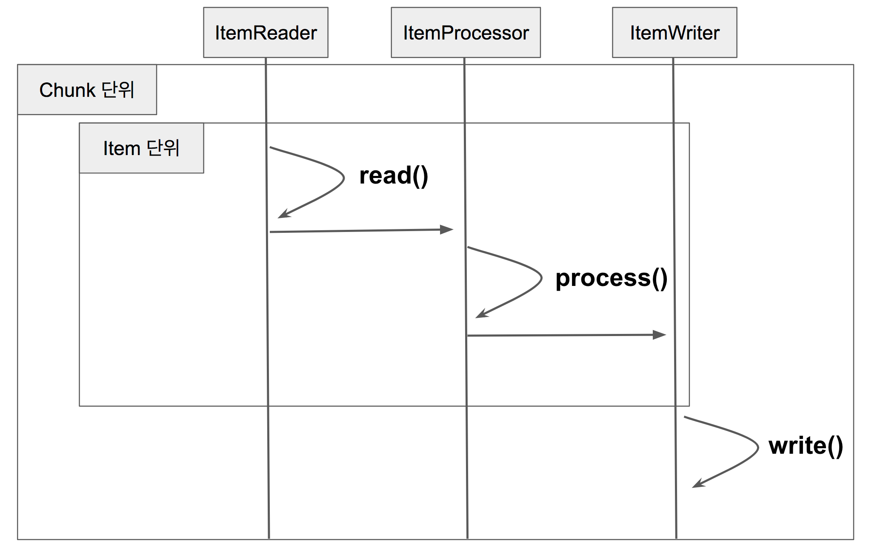

# spring-batch


## Chunk 단위로 데이터 처리


-> 코드로 나타내보면 아래와 같다.
```java
for(int i=0; i<totalSize; i+=chunkSize){ // chunkSize 단위로 묶어서 처리
    List items = new Arraylist();
    for(int j = 0; j < chunkSize; j++){
        Object item = itemReader.read()
        Object processedItem = itemProcessor.process(item);
        items.add(processedItem);
    }
    itemWriter.write(items);
}
```

### Version

Spring Boot : 3.1.1

Spring Batch : 5.0.2

### reference

- https://jojoldu.tistory.com/

- https://www.zodaland.com/tip/72